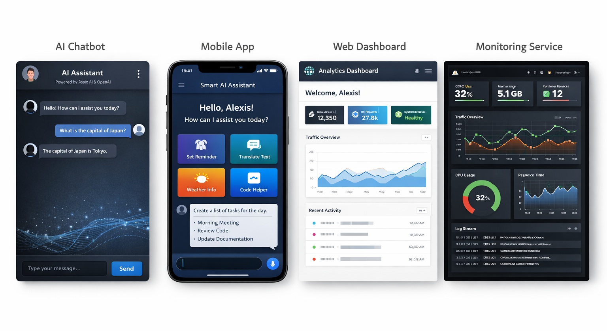
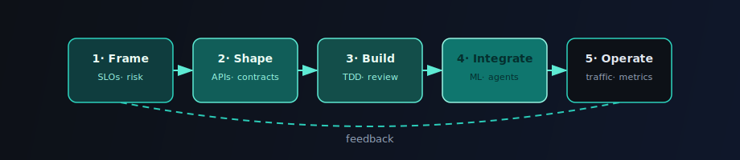

<!-- Profile repo: https://github.com/YOUR_USERNAME/YOUR_USERNAME (public README.md at root) -->

  

**Scalable services · clean APIs**  
**ML in production** (TensorFlow / PyTorch) · **AI-assisted delivery** (agents + automation)

Inspired by [beautify-github-profile](https://github.com/rzashakeri/beautify-github-profile) · **Focus:** large-scale backend & distributed systems

<code>REST</code> · <code>APIs</code> · <code>pipelines</code> · <code>Android</code> / <code>iOS</code> · <code>TensorFlow</code> · <code>PyTorch</code> · <code>distributed systems</code>

Backend engineer focused on **Python**, **Go**, **Java**, **distributed systems**, and **API design**. I ship reliable services, wire **TensorFlow** / **PyTorch** into real products, and use **AI agents** (*Cursor, Copilot, Ollama, Continue*) to move faster with less toil.

### Toolkit

 

**Also:** DevOps · REST APIs · data pipelines · mobile backends · TDD (Jest / Mocha) · **Prompting** · **Agents** (Cursor, Copilot, Ollama) · **Continue**

---

## Highlights

<table>
<tr>
<td width="50%" valign="top">

### What I build

- **Backend services** integrating **Python** ML stacks for **vision** & **NLP**
- **Python / Node.js** systems: **REST APIs**, **pipelines**, production traffic & ops constraints
- **Mobile-ready APIs** (Android / iOS): **auth**, **sync**, **AI recommendations**

</td>
<td width="50%" valign="top">

### How I work

- **API-first** thinking, clear boundaries, measurable performance
- **TDD** where it pays off (**Jest**, **Mocha**)
- **Automation**: agents & prompts for reviews, scaffolding, and repetitive workflows

</td>
</tr>
<tr>
<td colspan="2" align="center" valign="top">

 

### Product screenshot

</td>
</tr>
</table>

---

## What I develop

<table>
<tr>
<td width="50%" valign="top">

**ML-backed services**  
Serving **TensorFlow** / **PyTorch** in real traffic: **image classification**, **text processing**, recommendation-style scoring behind stable APIs.

**Distributed backends**  
**Python** / **Node.js** services, **REST** contracts, **data pipelines**, tuning for throughput, failure modes, and day-2 operations.

</td>
<td width="50%" valign="top">

**Mobile-facing platforms**  
Endpoints for **Android** / **iOS**: **authentication**, **sync**, **AI-assisted** features—same patterns as any high-churn client surface.

**Product-grade web & quality**  
**React** stacks (**Router**, **Redux**, **Webpack**, **ES6**), **Android** clients where needed, **Jest** / **Mocha** and **TDD** when the risk profile calls for it.

</td>
</tr>
</table>

---

## Engineering loop

End-to-end flow in **five stages**; **feedback** closes the loop back to framing.

  

---

**Open to backend / platform / ML-serving conversations.**

UI patterns: <a href="https://github.com/rzashakeri/beautify-github-profile">beautify-github-profile</a> · <a href="https://skillicons.dev">Skill Icons</a> · <a href="https://github.com/kyechan99/capsule-render">Capsule Render</a>

  

